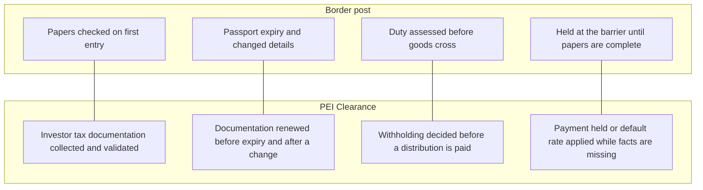
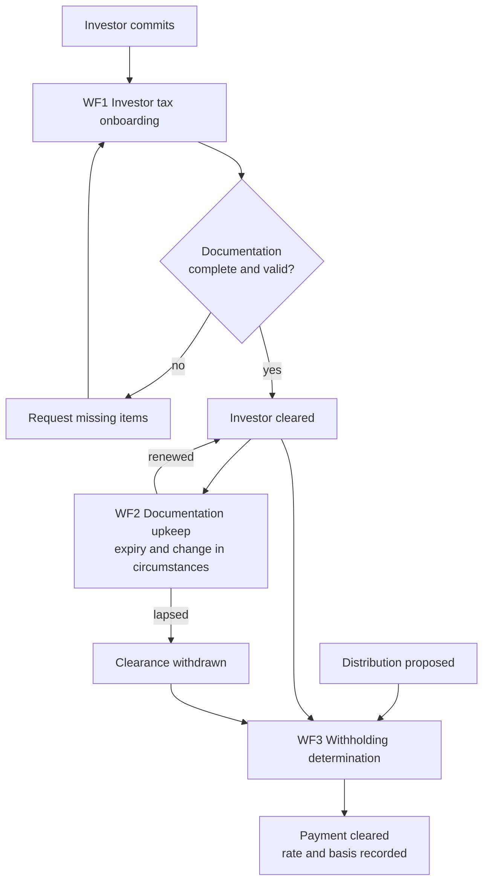
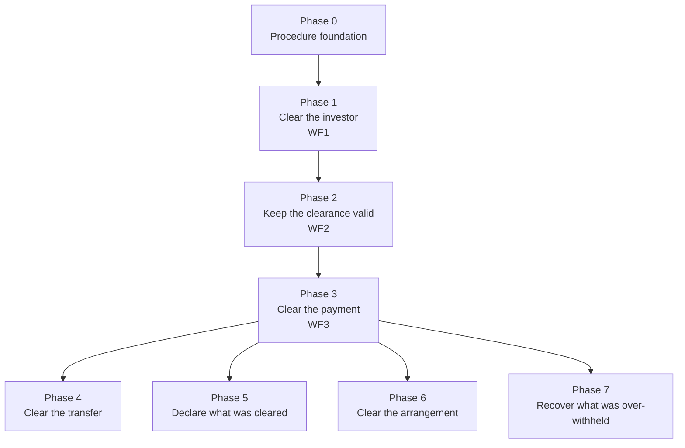

# PEI Clearance — business requirements

Business requirements for a product that runs the tax-documentation and withholding procedures of a cross-border private equity fund: clearing an investor, keeping that clearance valid, and clearing a payment before it is made. Domain background is in `../domain-narrative.md`. The companion analytical product is described in `../lookthrough-product/lookthrough-business-product.md`.

## 1. Product name

**Recommended: PEI Clearance.**

"Clearance" is a working term in tax and payments: an investor is cleared, a distribution is cleared for payment, a tax clearance is obtained. It names what each workflow in scope produces — a yes, no or not-yet decision that lets something proceed, with a named person signing it off.

| Alternative | Emphasis | Why not first choice |
|---|---|---|
| PEI Checkpoint | Gates before money moves | Less natural for annual reporting and reclaims |
| PEI Withholding Desk | The distribution decision | Leaves out onboarding and most of the roadmap |
| PEI Standing | Whether each investor's documentation is in good order | Covers the first two workflows only |

The rest of this document uses *Clearance*.

### Relationship to LookThrough

| | PEI LookThrough | PEI Clearance |
|---|---|---|
| Nature | Analytical: answers questions | Operational: runs procedures |
| Unit of work | A question and its answer | A case with steps, an owner, a deadline and a sign-off |
| Output | Exposure, footprint, supporting facts, gaps, reassessment list | A clearance decision and the record behind it |

Clearance uses LookThrough's answers at its decision points and does not derive them again.

## 2. Vision

**No investor is admitted, and no payment leaves the fund, without a clearance that says what was checked, against which rule, by whom, and until when it holds.**

### Analogy for executives: the border post

LookThrough is the navigation system: it holds the map and explains the route. Clearance is the border post on that route. Papers are checked on first entry, they expire and must be renewed, and duty is assessed before goods cross.

| Border post | Clearance | Workflow |
|---|---|---|
| Papers checked on first entry | Investor tax onboarding | WF1 |
| Passport expiry and changed details | Documentation upkeep and change in circumstances | WF2 |
| Duty assessed before goods cross | Withholding determination at distribution | WF3 |

The border officer decides; the post supplies the checks and keeps the record. Clearance prepares each decision and records it. The tax professional makes it.

## 3. Context

Domain background is in the domain narrative: [`../domain-narrative.md`](../domain-narrative.md). The narrative describes the fund, deal and company lifecycles, and outlines the investor tax documentation and withholding cycle (narrative section 5.4). Its source slides contain no treatment of withholding, tax documentation or reporting forms (narrative section 8), so that outline rests on other sources. The operating procedures for each workflow are in this folder.

A fund admits investors from several countries and later pays them distributions. Before a payment is made, the fund or its administrator must know each investor's tax status from documentation the investor supplies, must know that the documentation is still valid, and must decide whether tax is to be withheld. Each step has a deadline, and a missing or expired document has a default consequence.

The workflows that define the scope:

| ID | Workflow | Starts when | Ends when | LookThrough questions used |
|---|---|---|---|---|
| WF1 | Investor tax onboarding | An investor commits to the fund | The investor's tax documentation is validated and the investor is cleared | CQ5 |
| WF2 | Documentation upkeep and change in circumstances | A document nears expiry, or a status or ownership change is reported | Documentation is renewed and affected clearances are confirmed or withdrawn | CQ5, CQ6 |
| WF3 | Withholding determination at distribution | A distribution is proposed | Each investor's payment is cleared, with the rate and its basis recorded | CQ3, CQ4 |

Scope of the first release:

- The three workflows above, run on the same synthetic fund and investors used by LookThrough.
- All data is synthetic. No client or real investor data is used.
- The one obligation and jurisdiction pair chosen for LookThrough phase 3 sets which documents, deadlines and rates apply.

Out of scope: tax opinions, filing returns with a tax authority, moving money, identity and anti-money-laundering screening, and workflows listed in the roadmap after phase 3.

Constraint on sources: the benchmarks in section 6 come from United States and Luxembourg rules and from industry surveys. They illustrate the scale of the problem. They apply to the first release only if the chosen jurisdiction pair includes them.

## 4. Problem and root cause

### Problem statements

1. **Onboarding delays the close.** Investors are asked for the same tax documents more than once, by more than one party, and entity investors take weeks to complete.
2. **Documentation lapses unnoticed.** Forms expire and investor circumstances change, and the fund finds out when a payment is due.
3. **Withholding is decided late.** The rate for each investor is worked out at distribution time, under pressure, from documents that may no longer be valid.
4. **Defaults are costly.** Where documentation is missing, the fund applies a default rate or holds the payment, and the investor disputes it afterwards.
5. **Decisions cannot be reconstructed.** Months later, nobody can show which document, rule and reviewer stood behind a given rate.
6. **Deadlines live in personal calendars.** Renewal dates and notification windows are tracked by individuals, not by the process.

### Root causes

| Root cause | Problems it drives |
|---|---|
| Tax documentation is collected as static forms, not as dated facts with a validity period | 1, 2, 3 |
| No single record of what each investor has supplied, so every party asks again | 1 |
| The facts a withholding decision needs are not listed in advance per investor type | 1, 3, 4 |
| Expiry and change-notification deadlines are not attached to the documents they govern | 2, 6 |
| A status or ownership change is not linked to the clearances that relied on the old facts | 2, 5 |
| The decision is stored as a rate, without the document, rule version and reviewer behind it | 5 |
| Procedures are known to experienced staff and not written as steps with owners | 3, 6 |

## 5. Audience

| Audience | What they need from Clearance | Workflows |
|---|---|---|
| Fund administration and investor services | A worklist of open requests per investor; one request per missing item | WF1, WF2 |
| Fund tax team (in-house or at the manager) | Cases ready for decision, with facts, rule and gaps attached; a sign-off record | WF2, WF3 |
| Fund finance and treasury | A clear or hold status for each payment before the distribution run | WF3 |
| Compliance and risk | Overdue renewals, payments made on a default rate, and the audit trail | WF2, WF3 |
| Investor relations | What is outstanding from each investor and why it is being asked for | WF1, WF2 |
| Investors | One request, stated once, with the reason and the deadline | WF1, WF2 |
| Executives (CFO, tax partner) | Assurance that no payment went out uncleared | Summary of all |

Secondary audience: the data and knowledge-engineering team who build and maintain the product.

## 6. Business objectives, benchmarks and ROI goals

The benchmarks below are published figures, not measurements of any one fund. Penalty and rate figures come from tax-authority instructions and law-firm summaries. Time and survey figures come from administrator and vendor publications and are indicative. No published source gives effort or cost per workflow, so that baseline must come from a practitioner before any ROI is claimed. On synthetic data, the first release can demonstrate correct case handling and elapsed time only.

| ID | Business objective | Benchmark | Target with Clearance | ROI goal |
|---|---|---|---|---|
| WF1 | Clear each investor's tax documentation before the close, with one request per missing item | Entity onboarding takes two to four weeks; 74% of managers say investor checks add 6 to 30 days to a close; one manager in seven has lost an investor over onboarding [1][2] | Required items listed per investor type at commitment; every scenario investor reaches cleared or a stated list of open items | Shorter time to cleared; fewer repeat requests |
| WF2 | Renew documentation before it lapses and re-examine clearances after a change | A US withholding certificate is valid to the end of the third following calendar year; a change must be notified within 30 days; a missing certificate means 30% default withholding [3] | Every expiry and reported change in the scenario opens a case before the deadline; affected clearances listed | No payment made on lapsed documentation; fewer default-rate cases |
| WF3 | Clear every investor payment before a distribution, with the rate and its basis recorded | Incorrect US withholding statements cost $340 per form, capped at about $4.19 million a year; 10% of the amount with no cap for intentional disregard [4] | Every scenario payment cleared, held or put on a default rate, each with document, rule version and reviewer | Fewer corrected statements; lower penalty exposure; less reviewer time per distribution |

Acceptance benchmark for the first release: each workflow reaches the expected outcome on every synthetic scenario, including cases where the correct outcome is "hold" or "default rate applied because a fact is missing".

ROI is to be calculated as:

> (hours saved × loaded hourly cost + avoided penalties, default withholding disputes and close delays) ÷ cost to build and run

Until a practitioner baseline exists, the ROI goals above are hypotheses.

## 7. Roadmap

Phases are ordered by dependency. Dates are not set. Phases 1 to 3 form the first release.

| Phase | Name | Outcome | Depends on | Exit criterion |
|---|---|---|---|---|
| 0 | Procedure foundation | Each first-release workflow written as steps, owners, deadlines and decision points for the chosen jurisdiction pair | LookThrough phase 3 choice of obligation and jurisdictions | Reviewed by a practitioner |
| 1 | Clear the investor | WF1 Investor tax onboarding | LookThrough CQ5 | Every scenario investor cleared or left with a stated list of open items |
| 2 | Keep the clearance valid | WF2 Documentation upkeep and change in circumstances | LookThrough CQ5, CQ6 | Every expiry and change scenario opens the right case in time |
| 3 | Clear the payment | WF3 Withholding determination at distribution | LookThrough CQ3, CQ4 | Every scenario payment cleared, held or defaulted with a full record |
| 4 | Clear the transfer | Transfer of an investor's interest: outgoing investor's withholding and incoming investor's onboarding | Phases 1 to 3 | Transfer scenarios handled end to end |
| 5 | Declare what was cleared | Annual account reporting and investor tax statements, drawn from the clearance record | Phases 1 to 3 | Reporting data set reconciles to the clearance record |
| 6 | Clear the arrangement | Assessment of a structuring step against mandatory disclosure rules | LookThrough CQ2, CQ4 | Reportable and non-reportable scenarios distinguished |
| 7 | Recover what was over-withheld | Treaty relief and reclaim cases | Phase 3 | Reclaim scenarios tracked to outcome |

Benchmarks already found for the later phases:

| Phase | Benchmark |
|---|---|
| 4 | The buyer of a US partnership interest from a foreign seller withholds 10% of the amount realised, which includes the seller's share of partnership liabilities; the partnership is liable if the buyer fails to withhold [5][6] |
| 5 | Luxembourg: up to €250,000 for due-diligence breaches, plus 0.5% of amounts not reported [7]. About 40% of venture funds report delayed or incorrect investor tax statements, from a single vendor source [8] |
| 6 | Maximum fines for failing to report within the 30-day window vary by country: €100,000 in France, €250,000 in Luxembourg, €830,000 in the Netherlands, €2.5 million in Poland [9] |
| 7 | Relief and reclaim procedures use more than 450 different forms across the EU. The Commission estimates €5.17 billion a year in investor savings from its reform, which covers publicly traded securities and not private funds [10] |

Open decisions that gate the roadmap:

- The obligation and jurisdiction pair, shared with LookThrough phase 3.
- A practitioner to review the written procedures in phase 0 and supply effort baselines.
- Whether Clearance and LookThrough are built on one shared model or two.

## Sources

1. IQ-EQ, fund managers' KYC survey: https://iqeq.com/insights/from-back-office-formality-to-front-line-differentiator-five-key-findings-from-our-fund-managers-kyc-survey/
2. Carta, investor onboarding: https://carta.com/learn/private-funds/management/fund-administration/investor-onboarding/
3. Taxes for Expats, Form W-8BEN-E guide: https://www.taxesforexpats.com/articles/foreign-business/form-w-8ben-e.html
4. IRS, Instructions for Form 1042-S (2026): https://www.irs.gov/instructions/i1042s
5. K&L Gates, Section 1446(f) final regulations: https://www.klgates.com/IRS-Issues-Section-1446f-Final-Regulations-10-28-2020
6. DLA Piper, final regulations for transfers of partnership interests: https://www.dlapiper.com/en-us/insights/publications/2023/01/final-regulations-for-transfers-of-partnership-interests-take-effect
7. Elvinger Hoss, FATCA and CRS obligations for Luxembourg reporting financial institutions: https://elvingerhoss.lu/publications/crsfatca-new-fatca-and-crs-obligations-luxembourg-reporting-financial-institutions
8. VC Lab, late investor tax statements: https://govclab.com/2025/04/08/problems-with-getting-k1s-to-lps/
9. International Tax Review, DAC6 applications by country: https://www.internationaltaxreview.com/article/2a6a6hc75o0v1ocwg2dc0/dac6-one-directive-several-applications
10. European Commission, FASTER proposal: https://eur-lex.europa.eu/legal-content/EN/TXT/HTML/?uri=CELEX:52023PC0324

Figures were taken from search summaries of these sources and have not been checked line by line against each document.
