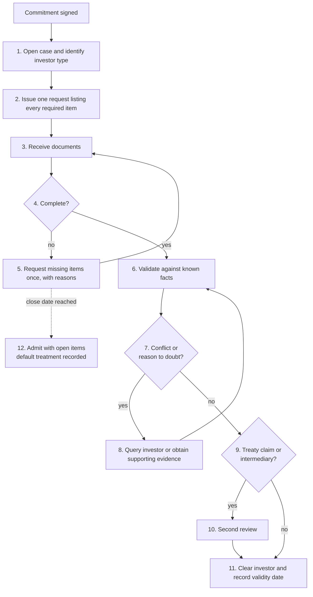

# WF1 Investor tax onboarding — operating procedure

Sample operating procedure for PEI Clearance. Requirements are in [`clearance-business-product.md`](clearance-business-product.md).

**Status: illustrative.** The forms, periods and rates use United States withholding documentation as the example. The obligation and jurisdiction pair for the first release is not yet chosen, and a practitioner has not reviewed these steps. All names are synthetic.

## 1. Policy

No investor is admitted to the fund until its tax documentation is validated, or the open items and their consequence are recorded and accepted by the fund tax team.

## 2. Scope

| | |
|---|---|
| Starts when | An investor signs a commitment to the fund |
| Ends when | The investor is cleared, or admitted with recorded open items |
| Covers | Collection and validation of the investor's tax self-certification |
| Does not cover | Identity and anti-money-laundering checks, subscription documents, tax advice to the investor |

## 3. Roles

| Role | Responsibility |
|---|---|
| Investor | Supplies and signs the certification; answers queries |
| Investor services (administrator) | Runs the case: requests, chases, checks completeness |
| Fund tax team | Validates the certification; decides clearance |
| Tax reviewer | Second review of treaty claims and intermediary structures |
| Investor relations | Contact with the investor when a request is overdue |

## 4. Inputs

- The investor's commitment and legal details.
- The required-facts list for the investor's type (LookThrough CQ5).
- The certification form that applies. In the illustration:

| Investor | Form |
|---|---|
| US person | W-9 |
| Foreign individual | W-8BEN |
| Foreign entity that is the beneficial owner | W-8BEN-E |
| Foreign intermediary or flow-through entity | W-8IMY, with a withholding statement and a form for each underlying owner |
| Foreign government, central bank or similar | W-8EXP |
| Foreign person with income connected to a US business | W-8ECI |

Form descriptions: https://www.irs.gov/forms-pubs/about-form-w-8

## 5. Procedure

| Step | Owner | Action | Deadline (illustrative) | Output |
|---|---|---|---|---|
| 1 | Investor services | Open an onboarding case. Identify the investor type and select the form | Day of commitment | Case opened |
| 2 | Investor services | Send one request listing every required item, with the reason for each | 1 business day | Request issued |
| 3 | Investor | Return the signed form and any supporting documents | 10 business days | Documents received |
| 4 | Investor services | Check completeness: right form, every required part filled, signed, dated, signatory has capacity | 2 business days | Complete, or list of gaps |
| 5 | Investor services | Send one follow-up listing all gaps. Escalate to investor relations if unanswered after 5 business days | — | Follow-up issued |
| 6 | Fund tax team | Compare the form with facts already held: name, address, country of formation, entity type, ownership | 3 business days | Validation result |
| 7 | Fund tax team | Decide whether anything gives reason to doubt the form, such as a foreign status claimed with a US address | With step 6 | Conflict recorded or none |
| 8 | Fund tax team | Query the investor or obtain evidence that resolves the conflict | 10 business days | Conflict resolved or left open |
| 9 | Fund tax team | Flag treaty claims and intermediary or flow-through investors | With step 6 | Flag set |
| 10 | Tax reviewer | Review the treaty claim, including the limitation-on-benefits statement, or the withholding statement and underlying forms | 3 business days | Review sign-off |
| 11 | Fund tax team | Clear the investor. Record the status, the form relied on, its validity end date and the reviewer | Before the close | Investor cleared |
| 12 | Fund tax team | If the close arrives first, admit with open items. Record each open item and the default treatment that applies until it is supplied | Close date | Admitted with open items |

## 6. Controls

| ID | Control | Evidence |
|---|---|---|
| C1.1 | Completeness check against the required-facts list for the investor type | Checklist with each item marked received, missing or not applicable |
| C1.2 | Reason-to-know check: form compared with facts already held | Validation record listing each comparison and result |
| C1.3 | Second review of every treaty claim and every intermediary structure | Reviewer name and date |
| C1.4 | No investor marked cleared without a validity end date | Clearance record |
| C1.5 | Admission with open items requires fund tax team approval | Approval record naming the items and the default treatment |

## 7. Outcomes

| Outcome | Meaning |
|---|---|
| Cleared | Documentation valid; status and validity end date recorded |
| Admitted with open items | Investor is in the fund; default treatment applies until items are supplied |
| Not cleared | Conflict unresolved; referred to the manager for a decision on admission |

## 8. Records kept

The form and supporting documents, the completeness checklist, the validation record, the reviewer sign-off, the clearance decision with its validity end date, and every request sent to the investor with dates.

## 9. Scenarios

| ID | Scenario | Expected outcome |
|---|---|---|
| S1.1 | Harbor Pension Trust, a foreign entity in Jurisdiction B, returns a complete W-8BEN-E with no treaty claim | Cleared at step 11; validity end date recorded |
| S1.2 | A foreign entity claims a treaty rate but leaves the limitation-on-benefits statement blank | Gap found at step 4; one follow-up; cleared after second review once supplied |
| S1.3 | A foreign fund-of-funds supplies W-8IMY without forms for two of its underlying owners | Admitted with open items at step 12; default treatment recorded for the undocumented share |
| S1.4 | An individual certifies foreign status and gives a US mailing address | Conflict at step 7; cleared only if step 8 produces evidence that resolves it |
| S1.5 | An investor does not respond before the close | Admitted with open items; default treatment recorded; case stays open |

## 10. LookThrough questions used

| Step | Question | Use |
|---|---|---|
| 1, 4 | CQ5 | The facts required for this investor type and which are still missing |
| 6 | CQ1, CQ2 | Ownership and jurisdiction facts already held, for the reason-to-know comparison |
