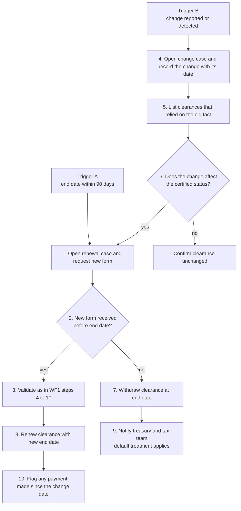

# WF2 Documentation upkeep and change in circumstances — operating procedure

Sample operating procedure for PEI Clearance. Requirements are in [`clearance-business-product.md`](clearance-business-product.md).

**Status: illustrative.** The forms, periods and rates use United States withholding documentation as the example. The obligation and jurisdiction pair for the first release is not yet chosen, and a practitioner has not reviewed these steps. All names are synthetic.

## 1. Policy

Every investor clearance has an end date. A clearance is renewed before it lapses and is re-examined whenever a fact it relied on changes. A lapsed clearance is withdrawn, not left in place.

## 2. Scope

| | |
|---|---|
| Starts when | A certification nears its validity end date, or a change in an investor's status or ownership is reported or detected |
| Ends when | The clearance is renewed, confirmed unchanged, or withdrawn |
| Covers | Renewal requests, change assessment, withdrawal of clearance |
| Does not cover | First-time onboarding (WF1), the withholding decision itself (WF3) |

## 3. Roles

| Role | Responsibility |
|---|---|
| Investor | Reports changes; supplies a new certification |
| Investor services (administrator) | Monitors end dates; issues and chases renewal requests |
| Fund tax team | Assesses changes; renews or withdraws clearance |
| Tax reviewer | Second review where the change alters the withholding treatment |
| Investor relations | Passes on changes learned from investor contact |

## 4. Inputs

- The clearance record from WF1: form relied on, status, validity end date.
- Change reports from the investor, investor relations, or the ownership register.
- The list of clearances and assessments that relied on the changed fact (LookThrough CQ6).

Illustrative periods:

| Item | Period | Basis |
|---|---|---|
| Validity of a W-8BEN or W-8BEN-E | To the last day of the third calendar year after signing | US rule |
| Investor's duty to report a change and supply a new form | Within 30 days of the change | US rule |
| First renewal request | 90 days before the end date | Procedure choice |
| Reminder | 30 days before the end date | Procedure choice |

US periods: https://www.irs.gov/instructions/iw8bene

## 5. Procedure

Two triggers lead into one decision.

| Step | Owner | Action | Deadline (illustrative) | Output |
|---|---|---|---|---|
| 1 | Investor services | Open a renewal case. Request a new certification, stating the end date and the consequence of a lapse | 90 days before end date; reminder at 30 days | Request issued |
| 2 | Investor services | Track receipt. Escalate to investor relations at the 30-day reminder | End date | Received or not |
| 3 | Fund tax team | Validate the new form using WF1 steps 4 to 10 | 5 business days from receipt | Validation result |
| 4 | Investor services | Open a change case. Record what changed, the date it took effect, the date it was learned, and the source | 1 business day from learning of it | Change recorded |
| 5 | Fund tax team | List every clearance and assessment that relied on the old fact | 2 business days | Affected list |
| 6 | Fund tax team | Decide whether the change affects the certified status. A change of tax residence, entity type, treaty eligibility or beneficial owner does; a change of contact name does not | With step 5 | Affected or not |
| 7 | Fund tax team | Withdraw the clearance when the end date passes, or 30 days after a status-affecting change, without a valid new form | On the date | Clearance withdrawn |
| 8 | Fund tax team | Renew the clearance. Record the new form, status and end date. The earlier record is kept, not overwritten | On validation | Clearance renewed |
| 9 | Fund tax team | Notify treasury and the tax team of each withdrawn clearance and the default treatment that now applies | Same day as step 7 | Notification sent |
| 10 | Fund tax team | Where a change took effect before it was learned, list payments made in between and refer them for review | 5 business days | Payments flagged |

## 6. Controls

| ID | Control | Evidence |
|---|---|---|
| C2.1 | Monthly report of clearances ending within 90 days, each with an open renewal case | Report with case references |
| C2.2 | Every reported change has a recorded effective date and learned date | Change record |
| C2.3 | Every change case lists the clearances that relied on the old fact, or states that there are none | Affected list |
| C2.4 | No clearance remains active past its end date | Exception report, expected to be empty |
| C2.5 | Second review where a change alters the withholding treatment | Reviewer name and date |
| C2.6 | Earlier clearance records are retained when a clearance is renewed or withdrawn | History of the clearance |

## 7. Outcomes

| Outcome | Meaning |
|---|---|
| Renewed | New form validated; new end date recorded |
| Confirmed unchanged | Change does not affect the certified status |
| Withdrawn | No valid form; default treatment applies in WF3 until renewed |
| Payments flagged | Payments made between the change date and the date it was learned are referred for review |

## 8. Records kept

The renewal request and reminders with dates, the change record, the affected list, the new form and its validation, the renewal or withdrawal decision, the notification to treasury, and the full history of the clearance.

## 9. Scenarios

| ID | Scenario | Expected outcome |
|---|---|---|
| S2.1 | Harbor Pension Trust's form ends on 31 December. A new form arrives in November and validates | Renewed at step 8; no gap in clearance |
| S2.2 | An investor's form ends on 31 December and no reply is received | Withdrawn at step 7 on 1 January; treasury notified; default treatment applies to the next distribution |
| S2.3 | Investor status change C-01: an investor reports that it moved its tax residence from Jurisdiction B to Jurisdiction A three weeks ago | Change case opened; status affected; new form requested; clearance withdrawn if none arrives within 30 days of the change |
| S2.4 | A change of tax residence took effect in March and is reported in July. A distribution was paid in May | New form requested; the May payment flagged at step 10 |
| S2.5 | An investor changes its contact person and registered office within the same country | Confirmed unchanged at step 6 |
| S2.6 | An investor is acquired, and its new parent is in another jurisdiction | Change case opened; fund tax team decides whether beneficial ownership or treaty eligibility is affected; second review |

## 10. LookThrough questions used

| Step | Question | Use |
|---|---|---|
| 3 | CQ5 | Facts still missing after the new form is received |
| 5 | CQ6 | Clearances and assessments that could change because of this change |
| 10 | CQ3 | Cross-border payments made to the investor in the period |
