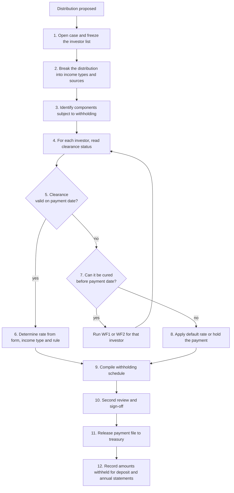

# WF3 Withholding determination at distribution — operating procedure

Sample operating procedure for PEI Clearance. Requirements are in [`clearance-business-product.md`](clearance-business-product.md).

**Status: illustrative.** The forms, periods and rates use United States withholding documentation as the example. The obligation and jurisdiction pair for the first release is not yet chosen, and a practitioner has not reviewed these steps. The procedure shows the shape of the decision; it does not state which rule applies to any real payment. All names are synthetic.

## 1. Policy

No distribution is released until every investor's payment is cleared at a documented rate, put on a recorded default rate, or held. Each decision names the form, the rule version and the reviewer behind it.

## 2. Scope

| | |
|---|---|
| Starts when | The manager proposes a distribution |
| Ends when | Every investor line is cleared, defaulted or held, and the payment file is released |
| Covers | Classifying the distribution, deciding the rate per investor, sign-off |
| Does not cover | The distribution waterfall calculation, paying withheld tax to the authority, filing returns and annual statements |

## 3. Roles

| Role | Responsibility |
|---|---|
| Fund finance | Supplies the distribution amounts per investor and the make-up of the distribution |
| Fund tax team | Classifies income, determines the rate per investor, prepares the schedule |
| Tax reviewer | Second review and sign-off of the schedule |
| Treasury | Releases payments only against a signed schedule |
| Investor relations | Tells affected investors about default rates and holds |

## 4. Inputs

- The distribution notice: total, date, amount per investor.
- The make-up of the distribution by income type and source, such as dividend, interest, gain on sale, return of capital.
- Each investor's clearance status from WF1 and WF2.
- The supporting facts and rule for each obligation (LookThrough CQ4) and the payments that cross a border (LookThrough CQ3).

Illustrative rates:

| Situation | Rate | Basis |
|---|---|---|
| US-source dividend or interest paid to a documented foreign investor, no treaty claim | 30% | US statutory rate |
| Same, with a valid treaty claim | The treaty rate | The treaty named on the form |
| Same, with no valid documentation | 30% | Default under the US presumption rules |

US rules: https://www.irs.gov/publications/p515

## 5. Procedure

| Step | Owner | Action | Deadline (illustrative) | Output |
|---|---|---|---|---|
| 1 | Fund tax team | Open a distribution case. Freeze the investor list and holdings as at the record date | 10 business days before payment | Case opened |
| 2 | Fund finance | Break the distribution into components by income type and source | 8 business days before | Component schedule |
| 3 | Fund tax team | For each component, record whether a withholding rule applies and which rule version | 7 business days before | Components marked |
| 4 | Fund tax team | Read each investor's clearance status and validity end date | 7 business days before | Status per investor |
| 5 | Fund tax team | Test that the clearance is valid on the payment date, not only today | With step 4 | Valid or not |
| 6 | Fund tax team | Determine the rate for each investor and component. Record the form, the rule version and, for a reduced rate, the treaty and article relied on | 5 business days before | Rate with basis |
| 7 | Fund tax team | For each investor without a valid clearance, decide whether it can be cured in time. If so, pass to WF1 or WF2 with the payment date as the deadline | 5 business days before | Cure case or not |
| 8 | Fund tax team | Where it cannot be cured, apply the default rate, or hold the payment if the fund's terms allow. Record which and why | 3 business days before | Default or hold |
| 9 | Fund tax team | Compile the schedule: investor, component, gross, rate, tax, net, basis | 3 business days before | Withholding schedule |
| 10 | Tax reviewer | Review every reduced rate, every default and every hold. Reconcile totals to the distribution notice. Sign off | 2 business days before | Signed schedule |
| 11 | Treasury | Release payments only against the signed schedule. Any later change returns to step 9 | Payment date | Payments made |
| 12 | Fund tax team | Record amounts withheld per investor for deposit with the authority and for the annual statements | 1 business day after | Withholding record |

## 6. Controls

| ID | Control | Evidence |
|---|---|---|
| C3.1 | Every investor on the frozen list has exactly one outcome per component: cleared, default or hold | Schedule with no blank lines |
| C3.2 | Clearance validity tested against the payment date | Validity end date shown beside the payment date |
| C3.3 | Every rate below the statutory rate cites a form, a rule version and a treaty article | Basis column in the schedule |
| C3.4 | Schedule totals reconcile to the distribution notice: gross, tax and net | Reconciliation signed by the reviewer |
| C3.5 | Second review by a person who did not prepare the schedule | Reviewer name and date |
| C3.6 | Treasury releases payments only against a signed schedule, and the payment file matches it | Signed schedule reference on the payment file |
| C3.7 | Investors on a default rate or hold are told before payment, with the item needed to cure | Notice with date |

## 7. Outcomes

| Outcome | Meaning |
|---|---|
| Cleared | Paid net of tax at a documented rate, or gross where no withholding applies |
| Default rate applied | Paid net of the default rate because a required fact is missing |
| Held | Payment withheld in full pending documentation, where the fund's terms allow |
| Not applicable | The component is not subject to withholding for this investor; recorded with the reason |

## 8. Records kept

The distribution notice, the component schedule, the withholding schedule with basis for each line, the clearance status relied on for each investor, the reviewer sign-off and reconciliation, notices to investors, the released payment file, and the withholding record.

## 9. Scenarios

Distribution D-001 from Atlas Growth Fund I passes on a US-source dividend received through Atlas Acquisition SPV.

| ID | Scenario | Expected outcome |
|---|---|---|
| S3.1 | Harbor Pension Trust is cleared with a valid treaty claim | Cleared at the treaty rate; treaty and article recorded; second review |
| S3.2 | A foreign entity is cleared with no treaty claim | Cleared at 30% |
| S3.3 | A US investor is cleared on a W-9 | Not applicable; paid gross |
| S3.4 | An investor's clearance was withdrawn in WF2 scenario S2.2 and cannot be cured in time | Default rate applied; investor notified with the item needed |
| S3.5 | An investor's form is valid today but ends before the payment date | Caught at step 5; passed to WF2 with the payment date as deadline |
| S3.6 | A fund-of-funds was admitted with two undocumented underlying owners (WF1 scenario S1.3) | Documented share cleared at its rates; undocumented share at the default rate |
| S3.7 | The distribution is entirely a return of capital | Each investor recorded as not applicable, with the reason; schedule still signed |
| S3.8 | After sign-off, fund finance corrects the amount for one investor | Returns to step 9; new schedule signed before release |

## 10. LookThrough questions used

| Step | Question | Use |
|---|---|---|
| 1 | CQ1 | Investors with an interest in the portfolio company that paid the income |
| 2, 3 | CQ3 | Which payments in the chain cross a border, and on which jurisdiction dimension |
| 6 | CQ4 | The facts and rule version that support the obligation and the rate |
| 7, 8 | CQ5 | The facts missing for investors who cannot be cleared |
