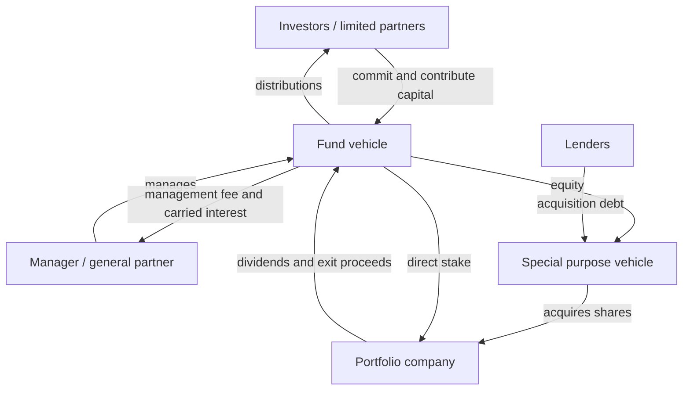
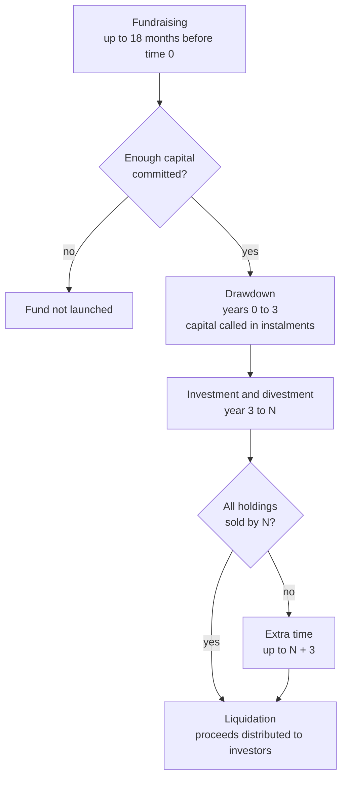
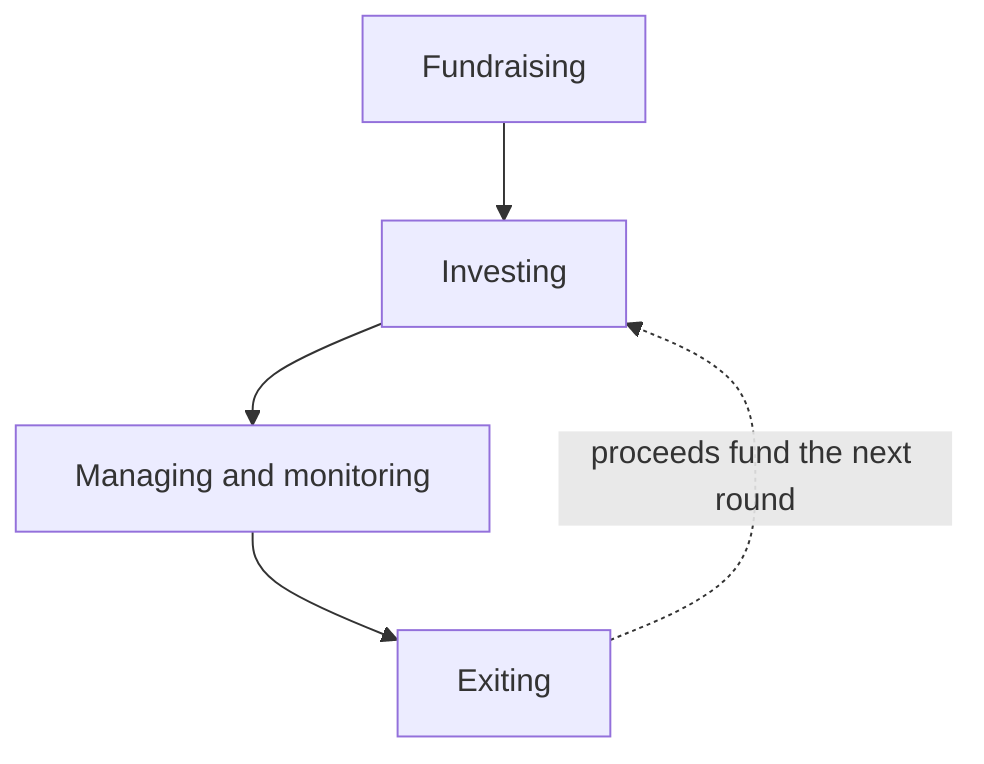
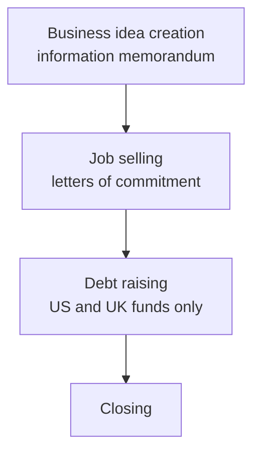
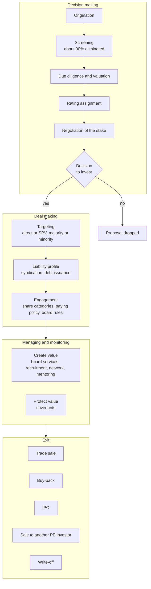
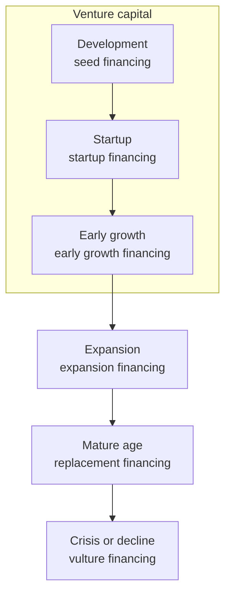
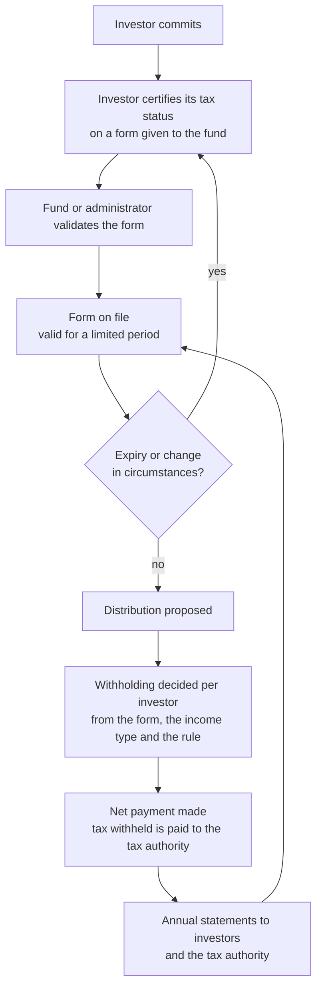

# Cross-border private equity investment — domain narrative

This document describes the domain in business terms: what it is, who takes part, how it unfolds over time, the concepts that matter, and where it is hard. It is general background. It serves both products. Product scope and requirements are in `lookthrough-product/lookthrough-business-product.md` and `clearance-product/clearance-business-product.md`.

## 1. The domain

Private equity (PE) is an investment by a professional investor in the equity of a non-listed company. For the company it is an alternative to a loan or a public listing; for the investor the profit comes almost entirely from selling the shares later at a gain (W1 p3–5). Venture capital is the early-stage case of PE (W1 p3).

A PE fund pools money from investors, uses it to buy stakes in companies through one or more legal entities, holds and improves those companies, and sells them. In the cross-border case the investors, the fund vehicle, intermediate entities and portfolio companies sit in different jurisdictions. Every ownership link and every payment may then cross a border and carry a tax or reporting consequence.

## 2. Sources

| Ref | Source | Content |
|---|---|---|
| W1 | [`Slides-Week-1.pdf`](https://www.coursera.org/learn/private-equity) — Bocconi, *Private Equity and Venture Capital*, Module 1 (Caselli) | What PE is, company life stages, deal types, SPV and LBO structures |
| W2 | [`Slides-Week-2.pdf`](https://www.coursera.org/learn/private-equity) — Module 2 | Investor vehicles by legal format, fund lifetime, fees and carry, taxation overview |
| W3 | [`Slides-Week-3.pdf`](https://www.coursera.org/learn/private-equity) — Module 3 | The managerial process: fundraising, investing, monitoring, exiting; covenants |
| W4 | [`Slides-Week-4.pdf`](https://www.coursera.org/learn/private-equity) — Module 4 | Valuation at entry and exit, IRR |

The slide decks are course material from the Coursera course [*Private Equity and Venture Capital*](https://www.coursera.org/learn/private-equity) (Università Bocconi). They are not redistributed in this repository; the links above lead to the course, where enrolled learners can download them. Citations use the form `W2 p48`, meaning PDF page 48 of the Week 2 deck. Acronyms are expanded in [`domain-glossary.md`](domain-glossary.md). The slides teach business vocabulary; they are not legal authority (section 8). Statements that go beyond the slides are marked *(beyond slides)*.

## 3. The story in brief

A management team has an investment idea and a track record. It writes an information memorandum and sells the idea to institutions and wealthy individuals, who sign letters of commitment (W3 p15–18). If enough capital is committed, a vehicle is formed. Its rules are fixed in a governing document: an internal code of activity approved by a supervisor in the European format, or a limited partnership agreement in the Anglo-Saxon format (W3 p17, W2 p50).

Investors do not hand over all their money on day one. The manager calls it in instalments as deals are found (W2 p22). For each deal the manager screens many proposals, performs due diligence and valuation, negotiates a stake, and decides whether to invest directly in the company or through a special purpose vehicle that may also borrow from banks (W3 p24–38, W1 p36–37, p42–44).

While the fund holds a stake it sits on the board, supports management and protects its position through contractual covenants (W3 p45–54). At exit it sells the stake to a corporate buyer, the existing shareholders, the public market or another fund (W3 p59–64). Proceeds flow back to investors after the manager takes annual management fees and, if performance clears a hurdle, carried interest (W2 p27–32).

In the cross-border case each of those steps touches more than one jurisdiction, and the tax result depends on the combination of investor, vehicle and company countries (W2 p71–74).

## 4. Participants and vehicles

### 4.1 Roles

| Role | Description | Source |
|---|---|---|
| Investor / limited partner | Supplies capital, does not manage, liable only up to the amount invested. Typically pension funds, insurers, banks, corporations, governments, high-net-worth individuals | W2 p14, p49, p53 |
| Manager / general partner | Runs the vehicle and makes investment decisions; fully liable in a limited partnership | W2 p49–50 |
| Management company | The firm that employs the team. An asset management company (AMC) in Europe; in the US the GP is usually itself a management company formed as a limited-liability entity | W2 p11–12, p51 |
| Fund vehicle | The pooled entity that holds the investments | W2 p11–13, p47 |
| Special purpose vehicle (SPV) | An "empty box" created for one transaction, funded with equity and bank debt, that acquires the target | W1 p36–37, p42–44 |
| Portfolio company | The non-listed business receiving investment; the slides call it the venture-backed company | W1 p3–5 |
| Lender | Banks financing the SPV or the company | W1 p37, p44; W3 p38 |
| Supervisor | The authority that approves and oversees the manager and fund in the European format; absent in the Anglo-Saxon format | W2 p5, p7, p12 |
| Advisers and committees | Technical committee, advisory board, advisory company involved in deal decisions | W3 p24–26 |

A role is not an identity. The same party can manage one vehicle and invest in another: the AMC holds a commitment in its own funds (W2 p12), and banks commonly act as either GP or LP (W2 p59).

### 4.2 How the parties connect

### 4.3 Two legal formats

A format describes how the vehicle is regulated, not where the deal happens, and a global investor can choose either (W2 p4, p8).

| | European Union format | Anglo-Saxon format |
|---|---|---|
| View of PE | A regulated financial service | An entrepreneurial business activity |
| Framework | Banking and financial-services directives, AIFM directive | Common law, ad hoc fiscal rules, PE-specific regulation |
| Typical vehicle | Closed-end fund managed by an AMC | Limited partnership with LPs and a GP |
| Governing document | Internal code of activity, approved by the supervisor | Limited partnership agreement, a contract |
| Dispute forum | Supervisor | Court |
| Leverage at fund level | Not permitted for closed-end funds | Permitted |
| Source | W2 p5–6, p10–16 | W2 p7, p44–52 |

Other vehicles in the slides: banks and investment firms with A and B shareholders (W2 p35–42), SBICs (W2 p56–58), UK venture capital trusts (W2 p65–68), corporate ventures and business angels (W2 p59–60), and newer forms such as private debt funds and SPACs (W2 p79–83).

## 5. Lifecycles

Three lifecycles run at once: the fund's, each deal's, and each portfolio company's. A fourth cycle, for each investor's tax documentation, runs alongside them.

### 5.1 Fund lifecycle

For a closed-end fund with maturity N, commonly 10 years (W2 p20–24):

A ten-year fund typically completes two investment–exit rounds (W2 p23). Many funds never reach time 0 (W2 p21).

The slides also describe fund activity as a four-step managerial process (W3 p5–10). The steps overlap, since the manager is investing in some companies while monitoring and exiting others (W3 p7).

Fundraising itself has four steps (W3 p14–20):

### 5.2 Deal lifecycle

One investment, from first sight to sale (W3 p24–41, p45–64):

### 5.3 Company life stage and financing type

The stage of the portfolio company determines the kind of financing and its risk (W1 p15–18):

| Financing type | Notes | Source |
|---|---|---|
| Seed | Financing an idea; highest risk | W1 p22–24 |
| Startup | Financing a business plan | W1 p25–26 |
| Early growth | Hands-on; often a large stake | W1 p27 |
| Expansion | Organic growth, or acquisition directly or through an SPV | W1 p31–38 |
| Replacement | LBO, PIPE, corporate governance deals | W1 p41–46 |
| Vulture | Restructuring, or purchase of assets from a failed company | W1 p49–54 |

Multi-entity ownership chains arise mainly in expansion and replacement financing, where SPVs and acquisition debt are used.

### 5.4 Investor tax documentation and withholding cycle

This cycle runs alongside the fund lifecycle for each investor. The slides do not describe it *(beyond slides)*.

- **Self-certification.** The investor, not the fund, states its tax status: who it is, where it is tax resident, what kind of entity it is, and whether it claims a reduced rate under a tax treaty. In the United States these statements are made on Form W-9 by US persons and on the W-8 series by foreign persons: https://www.irs.gov/forms-pubs/about-form-w-8
- **Withholding agent.** The party that controls a payment to a foreign person is responsible for withholding the right amount and is liable if it does not: https://www.irs.gov/individuals/international-taxpayers/withholding-agent
- **Validity.** A certification holds for a limited period and lapses earlier if the investor's circumstances change. The investor is expected to report a change and supply a new form.
- **Default treatment.** Where a valid certification is missing, the payer applies a default rate set by the rules, not the rate the investor would have qualified for.
- **Reliance.** The payer may rely on a form unless it knows, or has reason to know, that the form is wrong.
- **Annual statements.** Amounts paid and tax withheld are reported each year to the investor and the tax authority.

## 6. Key concepts

### 6.1 Ownership and structure

- **Stake.** The shares a fund receives for its cash (W1 p4). A stake may be majority or minority, and influence depends on voting rights and board seats as well as percentage (W3 p36).
- **Direct and indirect investment.** The fund can hold the company's shares itself or hold an SPV that holds them (W3 p35). Indirect holding is what creates an ownership chain.
- **Leveraged buyout.** The fund creates and wholly owns an SPV, the SPV borrows heavily, and uses the cash to buy the target (W1 p42–44).
- **Syndication.** Several investors take part in the same deal to share risk and increase capacity (W3 p37).
- **Share categories.** Common shares, shares with limited or enhanced rights, shares with embedded options, tracking stocks (W3 p39). Economic rights and voting rights can therefore diverge.

### 6.2 Money and economics

- **Commitment and drawdown.** A commitment is a promise to fund; a drawdown is the actual call for cash (W2 p22; W3 p18).
- **Management fee.** An annual percentage of the fund's initial size, typically 2%, meant to cover operating costs (W2 p28–29).
- **Carried interest.** The manager's share of performance above a hurdle rate, computed at the end of the fund. The slides give a simplified formula and call it the waterfall mechanism (W2 p31–32, p85–91).
- **Capital gain and dividends.** Capital gain at exit is the purpose of the activity; dividends are secondary (W1 p5; W2 p28, p75).
- **IRR.** The return measure linking entry price, exit price and holding period (W2 p31; W4 p5, p42–43).
- **Valuation.** Equity value is estimated at entry and again at exit, by discounted cash flow and by multiples (W4 p5–10).

### 6.3 Agreements and rights

- **Governing document.** Internal code of activity or limited partnership agreement (W2 p18, p50).
- **Information memorandum and letter of commitment.** The fundraising documents (W3 p15–18).
- **Covenants.** Lock-up, permitted transfer, staging, stock option plan, callable and puttable securities, tag-along, drag-along, right of first refusal, exit ratchet (W3 p52–54). Several govern who may transfer shares and when, so they shape how ownership can change.

### 6.4 Jurisdiction and tax

The slides frame taxation by player and by area of impact (W2 p71–72):

| Player | Capital gains | Dividends | Incentives |
|---|---|---|---|
| Vehicle | Relevant | Relevant | Not relevant |
| Investor | Relevant | Relevant for gains paid out through earnings | Not relevant |
| Portfolio company | Not relevant | Not relevant | R&D and startup incentives; debt-versus-equity incentives |

- **Vehicle-level treatment.** Participation exemption, flat tax, or tax transparency (W2 p73).
- **Tax transparency.** The vehicle bears no tax and investors are taxed in their home country. The slides attribute this to US and UK funds (W2 p73).
- **Investor status.** The burden depends on whether the investor is domestic or foreign relative to the vehicle, and a private individual or a legal entity. The four-cell matrix differs by country (W2 p74).
- **Company-level incentives.** Mark-down, shadow costs and tax credits for R&D and startups; thin capitalisation limits on interest deductions and incentives for equity funding (W2 p76–77).

Distinctions that matter in cross-border work but are not drawn in the slides *(beyond slides)*:

- Where an entity is incorporated, where it is tax resident and where it operates are separate facts. Governing law belongs to an agreement, not an entity.
- Legal form is not tax classification; a tax status applies in a given jurisdiction for a given period.
- Taxable income allocated to an investor is not the same as cash paid to that investor. IRS guidance on Schedule K-1 describes partners being taxed on allocated income whether or not it is distributed: https://www.irs.gov/instructions/i1065sk1
- A fact, such as an investor's tax residence, differs from a conclusion, such as a withholding obligation. A conclusion rests on a rule, its conditions and evidence.

## 7. Challenges

### 7.1 Inherent in private equity

- **Illiquidity.** There is no market for the shares, so finding a buyer is slow and uncertain, and funds may need extra time to wind up (W1 p6; W2 p24; W3 p10, p56).
- **Negotiated pricing.** Price is the outcome of negotiation, not a market quote (W1 p6). The investor wants a low value at entry and a high value at exit (W4 p5, p37).
- **Dependence on the business plan.** Valuation and deal design rest on forecasts supplied by the company (W4 p7; W1 p25).
- **Investor–entrepreneur conflict.** The relationship is described as a temporary marriage that needs written rules (W3 p50, p67–69).
- **Fundraising risk.** Success depends on reputation and track record, and many funds fail to close (W2 p21; W3 p13, p20).
- **Leverage.** Debt in an SPV raises returns and risk, and brings in lenders as a further party to convince (W1 p42; W3 p28, p35).
- **Exit timing.** The right window depends on the company, the financial market and the rest of the portfolio, and can close quickly (W3 p57–58; W4 p63).
- **Fee pressure.** Fees charged on committed capital are under review by investors (W1 p59).

### 7.2 Added by crossing borders

- **No single rulebook.** Taxation differs in every country, and the two regulatory formats treat the same activity differently (W2 p4–8, p71).
- **Layered structures.** One investment can involve investors, a fund, a manager entity, one or more SPVs, lenders and a target, each link with its own percentage, rights and dates.
- **Exposure is not a single number.** Economic and voting interests differ by share class, and combining percentages along a chain needs stated assumptions *(beyond slides)*.
- **Investor mix.** The same fund can have domestic and foreign investors, individuals and legal entities, each with a different result (W2 p74).
- **Several jurisdiction facts per entity.** Formation, tax residence and operations can each be in a different country *(beyond slides)*.
- **Cash and tax diverge.** A payment record alone does not show the tax position *(beyond slides)*.
- **Change over time.** Ownership changes through drawdowns, syndication, transfers under covenants and exits; investor status and rules change too.
- **Missing information.** A fact absent from the records is unknown, not false *(beyond slides)*.
- **Traceability.** A tax conclusion is defensible only if it can be tied to a rule, its source and the evidence for each fact *(beyond slides)*.

## 8. Limits of the sources

**Unreliable claims.**

- W2 p48 states that US law requires limited partners to own 99% and general partners 1% of a limited partnership. Delaware law permits a general partner to be admitted without a contribution or partnership interest, subject to the agreement: https://delcode.delaware.gov/title6/c017/sc04/index.html
- W2 p53 states that PE investment through a US fund is taxed at 0% if fundraising, maturity and extension limits are met. This is not a dependable description of partnership taxation; see the IRS K-1 guidance linked in section 6.4.

**Simplifications.**

- The carried-interest formula and its description of catch-up (W2 p32) are a teaching simplification. Fund agreements define distribution waterfalls in more detail.
- The statements that closed-end funds can never use debt (W2 p13) and that the AMC must commit 2% (W2 p12) are presented as uniform across Europe without citing a provision.
- The 20% flat rate for European closed-end funds (W2 p73) is given without a jurisdiction or date.
- The slides date from about 2015 (W4 p61), so market figures and regulatory descriptions may be out of date.
- In the venture capital method example, 219,214.20 new shares is inconsistent with 100,000,000 existing shares and a 68.68% stake (W4 p47, p51).

**Not covered.** The slides contain no specific tax rule with conditions, exceptions and effective dates; no treatment of withholding, treaties, tax residence tests or reporting forms; no partnership allocation, capital account or tax basis mechanics; and no worked cross-border example.
