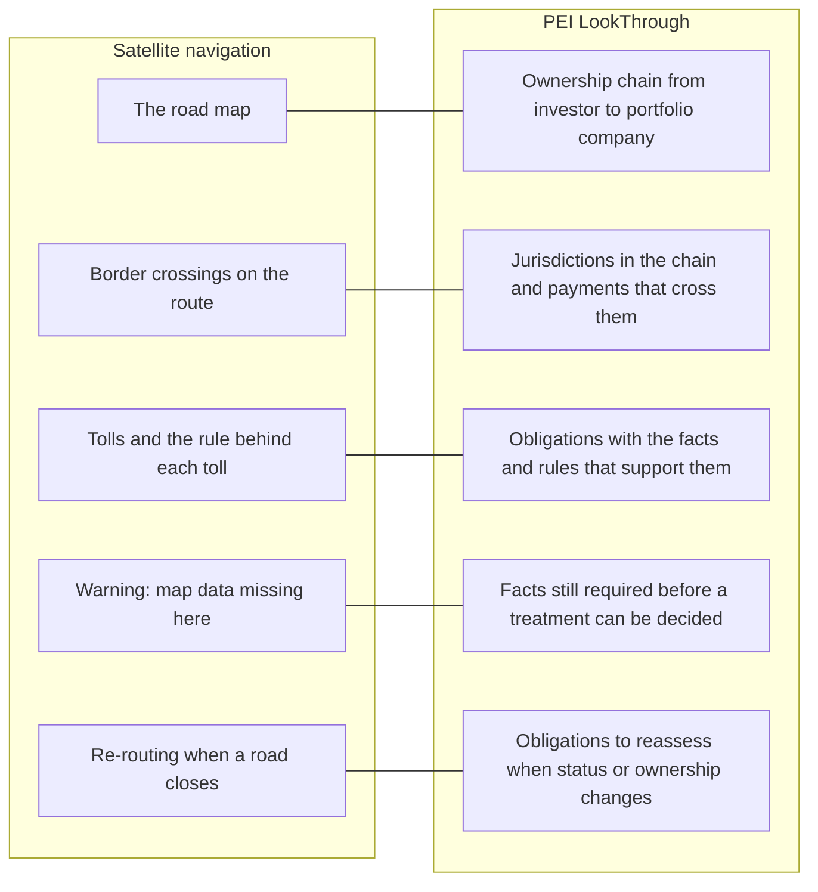
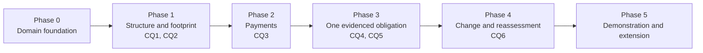

# PEI LookThrough — business requirements

Business requirements for a product that answers structure, payment and tax-obligation questions about private equity investments spanning several jurisdictions. Domain background is in `../domain-narrative.md`. The approach is described separately in `lookthrough-solution.md`.

## 1. Product name

**Recommended: PEI LookThrough.**

"Look-through" is the term tax and fund professionals already use for seeing past intermediate entities to the ultimate owners and the income that reaches them. That is what the competency questions ask for: look through the fund and its vehicles to the investors, the jurisdictions, the payments, and the facts and rules behind each obligation.

| Alternative | Emphasis | Why not first choice |
|---|---|---|
| PEI Obligation Tracer | Evidence behind obligations (CQ4–CQ6) | Understates the structure and payment questions (CQ1–CQ3) |
| PEI Structure Navigator | Ownership chains and jurisdictions (CQ1–CQ3) | Understates obligations and evidence |

The rest of this document uses *LookThrough*.

## 2. Vision

**For any cross-border private equity investment, anyone responsible for it can see who is exposed, which borders are crossed, what obligations follow, and why — and can see what is still unknown.**

### Analogy for executives: satellite navigation for fund structures

A driver crossing several countries does not carry each country's road atlas, toll schedule and border rules in their head. The navigation system holds the map, knows where the borders and tolls are, explains the route, warns when map data is missing, and re-routes when a road closes.

LookThrough does the same for an investment structure.

| Navigation | LookThrough | Competency question |
|---|---|---|
| The road map | Who holds what, through which entities | CQ1 |
| Border crossings | Jurisdictions in the chain; payments that cross them | CQ2, CQ3 |
| Tolls and their rules | Obligations, with supporting facts and rules | CQ4 |
| Missing map data | Facts required but not yet known | CQ5 |
| Re-routing | What to reassess after a change | CQ6 |

Navigation advises the driver; it does not drive. LookThrough supports the tax professional's judgement and shows its reasoning. It does not issue tax opinions.

## 3. Context

Domain background — participants, legal formats, lifecycles, key concepts and challenges — is in the domain narrative: [`../domain-narrative.md`](../domain-narrative.md). This section summarises only what bears on the requirements.

A private equity fund pools investor capital and invests through layers of legal entities. When investors, fund, intermediate vehicles and portfolio companies sit in different countries, each ownership link and each payment can carry a reporting or withholding consequence that depends on a combination of facts: entity type, jurisdiction, investor status, income type and date (`../domain-narrative.md` sections 4–7).

The competency questions that define the scope:

| ID | Question |
|---|---|
| CQ1 | Which investors have indirect exposure to a particular portfolio company? |
| CQ2 | Which jurisdictions are involved in an investment's ownership chain? |
| CQ3 | Which payments cross jurisdictional boundaries? |
| CQ4 | What facts and rules support an identified reporting or withholding obligation? |
| CQ5 | Which required facts are missing before a tax treatment can be determined? |
| CQ6 | Which obligations could change if an investor's status or ownership changes? |

Scope of the first release:

- One synthetic fund with a small set of investors and two portfolio companies in different jurisdictions, followed through commitment, acquisition, holding, distributions and exit.
- All data is synthetic. No client or real investor data is used.
- One reporting or withholding obligation, in one pair of jurisdictions, is sourced from primary legal material and used to exercise CQ4–CQ6.

Out of scope: tax opinions, a general tax rules engine, valuation, portfolio-company operations, and fund structures beyond the working scenario.

Constraint on sources: the course slides available today support the structure and lifecycle questions (CQ1 well, CQ2–CQ3 partly). They contain no tax rules, and two of their legal and tax claims are unreliable (`../domain-narrative.md` section 8). CQ4–CQ6 depend on primary sources still to be selected.

## 4. Problem and root cause

### Problem statements

1. **Exposure is slow to establish.** Finding every investor behind a portfolio company means walking structure charts and registers by hand, link by link.
2. **Jurisdictional footprint is unclear.** No single view shows every country an investment touches, or separates where an entity is formed, tax resident and operating.
3. **Cross-border payments are found late.** Payments are recorded as cash movements, without the jurisdiction context needed to see that a border was crossed.
4. **Obligations are hard to justify.** When an obligation is identified, the facts and the rule behind it are reconstructed from memory and email rather than retrieved.
5. **Gaps surface at the deadline.** Missing facts are discovered when a determination is attempted, not when the structure is set up.
6. **Change impact is guesswork.** When an investor's status or holding changes, nobody can list with confidence which earlier conclusions need another look.

### Root causes

| Root cause | Problems it drives |
|---|---|
| Structure, payments, investor facts and rules are held in separate documents and systems with no shared vocabulary | 1, 2, 3 |
| Ownership is drawn as pictures, not recorded as dated, queryable relationships | 1, 2, 6 |
| "Jurisdiction" is treated as one attribute, when incorporation, tax residence and operations are separate facts | 2, 3 |
| Conclusions are stored without the facts, rule version and evidence that produced them | 4, 6 |
| The facts a rule needs are not written down as a checklist, so absence goes unnoticed | 5 |
| Records show the current state only; history of status and ownership is overwritten | 6 |
| Unknown is recorded as blank and read as "no" | 5 |

## 5. Audience

| Audience | What they need from LookThrough | Questions |
|---|---|---|
| Fund tax team (in-house or at the manager) | Fast, defensible determinations and a list of open facts | CQ3–CQ6 |
| Tax advisers and reviewers | The reasoning trail behind each obligation; consistent treatment across engagements | CQ4–CQ6 |
| Fund administration and finance | Which payments need attention before they are made | CQ3 |
| Compliance and risk | Jurisdictional footprint and outstanding gaps per investment | CQ2, CQ5 |
| Deal and structuring team | The exposure and jurisdiction picture of a proposed structure | CQ1, CQ2 |
| Investor relations | Which investors are affected by a given portfolio company or event | CQ1, CQ6 |
| Executives (CFO, tax partner) | Confidence that obligations are known, evidenced and tracked | Summary of all |

Secondary audience: the data and knowledge-engineering team who build and maintain the product, addressed in the solution document.

## 6. Business objectives, benchmarks and ROI goals

Baselines below are working assumptions for a manual, document-based process. They are not measurements. Each must be replaced with observed figures from a real team before any ROI is claimed. On synthetic data, the first release can demonstrate correctness and answer time only.

| ID | Business objective | Benchmark: assumed manual baseline | Target with LookThrough | ROI goal |
|---|---|---|---|---|
| CQ1 | Identify every investor behind a portfolio company on request | Hours per request, walking charts and registers | Answer in under a minute; 100% of synthetic ownership paths found | Cut effort per exposure request by 90% |
| CQ2 | Show the full jurisdictional footprint of an investment | Compiled per deal from separate entity records | One view per investment, with formation, tax residence and operating location shown separately | Remove repeated compilation; no jurisdiction missed in test scenarios |
| CQ3 | Flag cross-border payments before they are made | Reviewed after the event, payment by payment | Every payment in the scenario classified as cross-border or not, with the dimension compared | Move review ahead of payment; fewer late corrections |
| CQ4 | Produce the facts and rules behind any identified obligation | Rebuilt from files and correspondence for each review | Every obligation linked to its facts, rule version and source | Halve reviewer time per determination |
| CQ5 | List missing facts as soon as a rule is in play | Found when the determination is attempted | Gap list available when the structure is recorded | Fewer last-minute information requests to investors |
| CQ6 | List obligations to reassess after a status or ownership change | Depends on individual memory | Every affected assessment listed for each change in the scenario | Fewer missed reassessments; lower penalty and rework exposure |

Acceptance benchmark for the first release: each competency question returns the expected answer on every synthetic scenario, including cases where the correct answer is "not applicable" or "cannot be determined".

ROI is to be calculated as:

> (hours saved × loaded hourly cost + avoided penalties and rework) ÷ cost to build and run

The inputs come from the baseline study in phase 4. Until then the ROI goals above are hypotheses.

## 7. Roadmap

Phases are ordered by dependency. Dates are not set.

| Phase | Name | Outcome | Questions | Exit criterion |
|---|---|---|---|---|
| 0 | Domain foundation | Domain narrative, competency questions and first draft structural model | — | Reviewed and agreed. Narrative and draft model exist today |
| 1 | Structure and footprint | Ownership chain and jurisdiction facts for the synthetic fund | CQ1, CQ2 | Both questions answered correctly on all scenarios |
| 2 | Payments | Payment events across the fund lifecycle, with cross-border classification | CQ3 | Every scenario payment classified correctly |
| 3 | One evidenced obligation | One obligation and jurisdiction pair sourced from primary law; supporting facts, rule and gap list | CQ4, CQ5 | Applicable, not-applicable and undetermined cases all handled |
| 4 | Change and reassessment | Dated status and ownership history; impact list after a change. Baseline study with a practitioner | CQ6 | Change scenarios produce the expected reassessment list; baselines recorded |
| 5 | Demonstration and extension | Public repository and walkthrough; decision on further obligations, jurisdictions or real-data pilot | All | Stakeholder review held; next scope chosen |

Open decisions that gate the roadmap:

- Choose the obligation and the two jurisdictions for phase 3.
- Identify a practitioner to supply baseline figures in phase 4.
