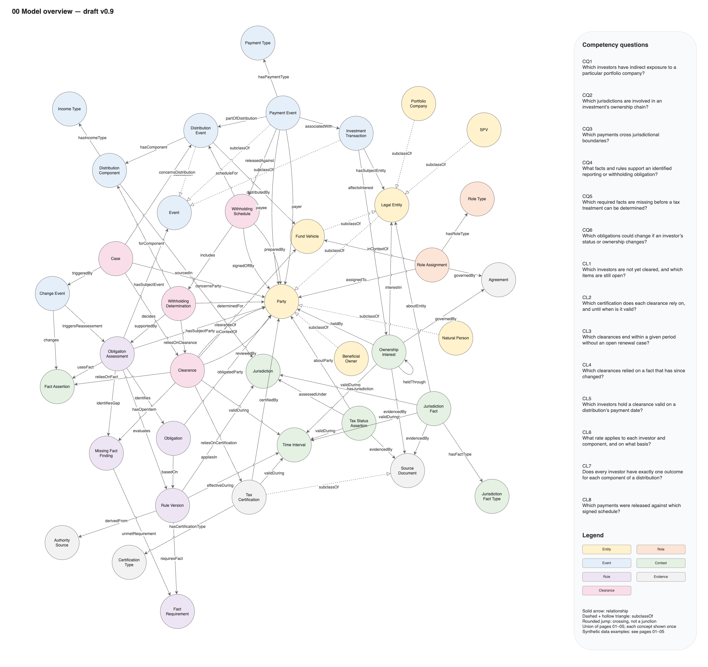
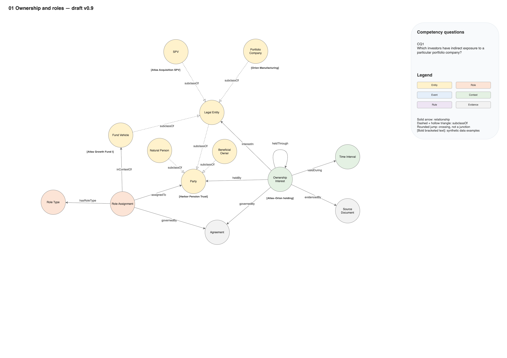
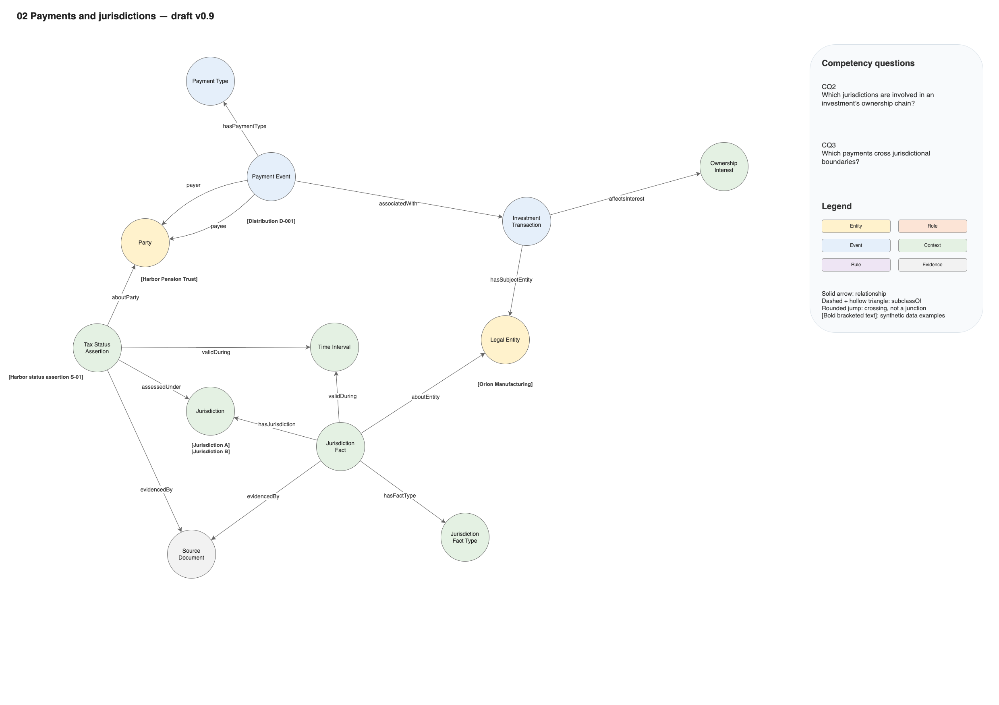
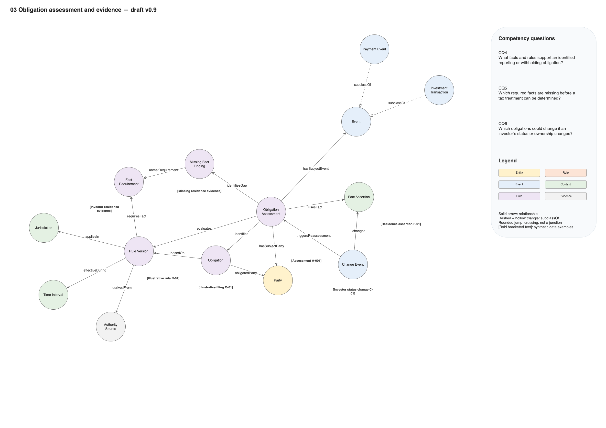
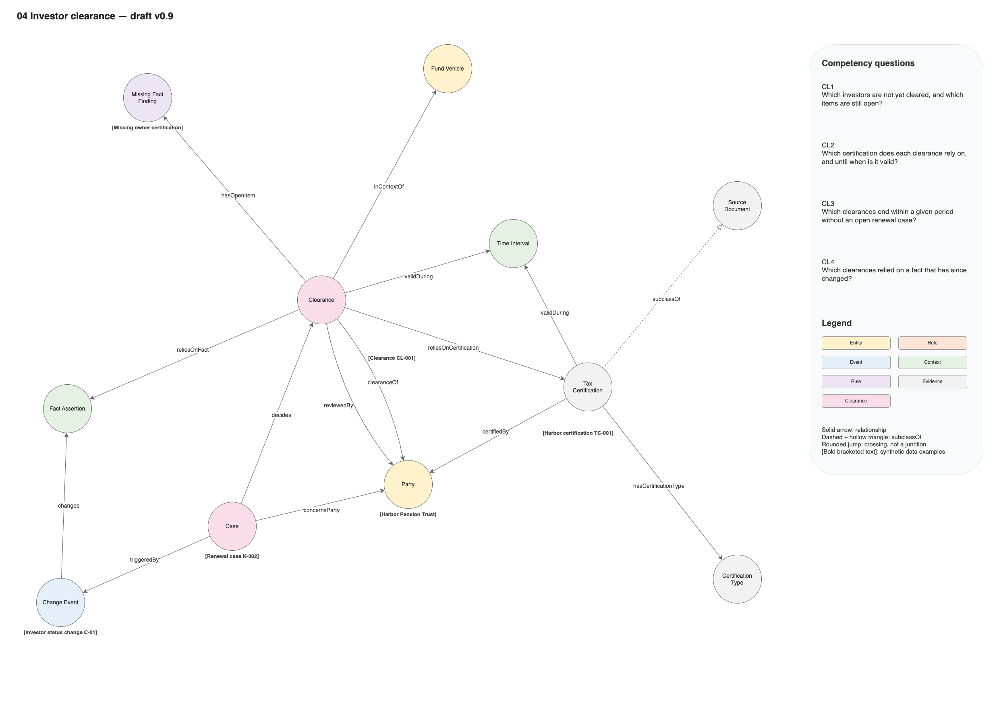
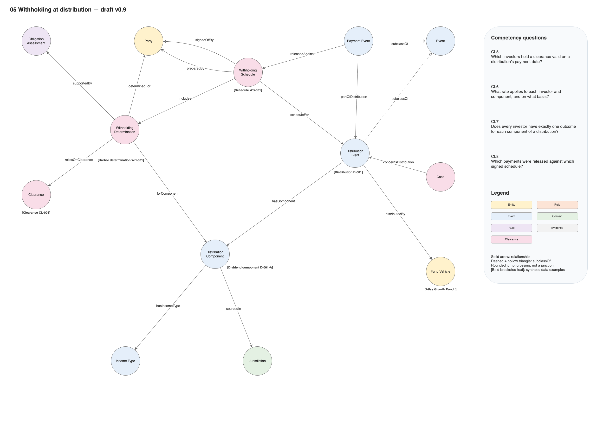

# Cross-border private equity conceptual model — draft v0.9

Open `xb-pei-model.drawio` in diagrams.net/draw.io. It contains an overview page and five editable detail pages with colored circular concepts and labeled, directed relationships. Dashed `subclassOf` arrows denote proposed specializations, not instance relationships. Other arrows describe candidate relationships, with one name per connector. Inheritance uses a dashed line and a small hollow triangle pointing to the superclass.

## Diagrams

PNG renderings of each page are in `diagrams/`, for viewing on GitHub. The Draw.io file is the source; the images were rendered from draft v0.9 and must be regenerated when the diagram changes.

### 00 Model overview

### 01 Ownership and roles

### 02 Payments and jurisdictions

### 03 Obligation assessment and evidence

### 04 Investor clearance

### 05 Withholding at distribution

## Purpose and scope

A first conceptual ontology for a synthetic private equity fund investing through legal entities across jurisdictions. It describes investment structure and the information needed for tax-obligation assessment. It is not an executable tax engine, validated legal ontology, or a model of every private equity structure. No jurisdiction-specific tax rule is implemented.

## Competency questions

| ID | Question | Page and proposed query approach |
|---|---|---|
| CQ1 | Which investors have indirect exposure to a particular portfolio company? | Page 1: traverse Ownership Interest → heldBy / interestIn at the requested date. Initially answer ownership-based exposure only. Economic percentages and voting percentages are distinct; do not infer full risk exposure or multiply percentages without defined assumptions. |
| CQ2 | Which jurisdictions are involved in an investment's ownership chain? | Pages 1–2: join ownership paths to dated incorporation, tax-residence and operating-location facts. Governing law belongs to the agreement. |
| CQ3 | Which payments cross jurisdictional boundaries? | Page 2: compare payer and payee jurisdictions at payment date, specifying which jurisdiction dimension is being compared. This does not establish a withholding obligation. |
| CQ4 | What facts and rules support an identified reporting or withholding obligation? | Page 3: Assessment → Fact Assertions / Rule Version → Authority Source, with an identified Obligation. |
| CQ5 | Which required facts are missing before a tax treatment can be determined? | Page 3: compare Rule Version's Fact Requirements with available facts; record gaps explicitly. |
| CQ6 | Which obligations could change if an investor's status or ownership changes? | Pages 1–3: preserve dated facts and assessments, trigger reassessment on change, compare results. |

## Modeling decisions proposed for review

- Separate a party's identity from its investor, limited-partner, general-partner and manager roles. One party may have multiple roles; GP and manager roles are not assumed identical.
- Represent ownership as an intermediate Ownership Interest so the holder, issuer/entity, percentages, share class, evidence and validity can be recorded.
- Fund Vehicle, SPV and Portfolio Company classifications can overlap. No disjointness axioms are implied.
- An entity can have multiple jurisdiction facts; incorporation is not synonymous with tax residence or operating location.
- Tax classification/status assertions are scoped to a jurisdiction and time. Legal form is not a substitute for tax classification.
- A Payment Event has a payer and payee. Acquisition/disposal transactions may involve multiple payments and affect ownership interests.
- Allocated taxable income is not a cash payment. Income allocation, tax basis and capital-account concepts are deferred until the selected tax scenario requires them.
- An assessment has a subject party/event, assessed date, assessor, reasoning and an applicable/not-applicable/undetermined result. Obligations are recorded separately from conclusions about their applicability.
- Preserve unknown values and missing facts. A graph's failure to contain a fact is not proof that the fact is false.
- Keep rule versions, effective periods and evidence. A change triggers review; it does not itself prove that an obligation changed.

## Source traceability and limits

The slides are course material from the Coursera course [*Private Equity and Venture Capital*](https://www.coursera.org/learn/private-equity) (Università Bocconi) and are not redistributed in this repository. Page references below mean PDF page numbers.

| Source | Relevant material | Use in this draft |
|---|---|---|
| Week 1, pp. 3–6, 19, 33–44 | Investment relationships, ownership involvement, SPVs and acquisition structures | Business entities, ownership and direct/indirect investment |
| Week 2, pp. 11–24, 26–32, 47–52 | Fund participants, lifecycle, fees/carry and partnership agreements | Fund/party roles, agreements, timing and payment vocabulary |
| Week 2, pp. 71–77 | Tax actors, income types, domestic/foreign investor distinctions | Motivation for jurisdiction/status facts; not authority for tax rules |
| Week 3, pp. 25–40, 50–64 | Due diligence, deal structure, share rights, covenants and exits | Transaction and contractual context |
| Week 4, pp. 4–23, 37–52 | Valuation and investment stakes | Optional future valuation extension; not central to current questions |

Jurisdiction Fact, Time Interval, Tax Status Assertion, Rule Version, Fact Requirement, Obligation Assessment, Missing Fact Finding and Change Event are proposed modeling extensions derived from the competency questions, rather than an assertion that the course defines these classes.

Do not encode Week 2's p. 48 claim of mandatory 99% LP / 1% GP equity or p. 53's broad U.S. tax exemption claim. These were identified as unreliable in the source review. For comparison:

- Delaware partnership law permits admission of a sole general partner without a contribution or partnership interest, subject to the agreement: https://delcode.delaware.gov/title6/c017/sc04/index.html
- IRS K-1 guidance explains potential partner tax on allocated income whether or not distributed: https://www.irs.gov/instructions/i1065sk1

These references explain source limitations; they have not yet been translated into rule instances.

## Next work

- Settle whether Jurisdiction Fact and Tax Status Assertion are kinds of Fact Assertion (see the v0.8 section).
- Review the nine clearance concepts and the proposed questions CL1–CL8.
- Select one tax obligation and jurisdiction pair; source its rule conditions and evidence requirements.
- Create synthetic scenarios covering applicable, not-applicable and undetermined outcomes, and validate each question against them.
- Parse the Turtle with an RDF library and run a profile check.

Visual styling follows a reference diagram from another project; its domain content is not reused.

## Diagram conventions applied in v0.2

Pale circular concept shapes, solid labeled relationship arrows, and dashed `subclassOf` connectors with hollow UML-style triangles. Each page uses a deterministic Fruchterman–Reingold force-directed layout (seed 42 plus page index), followed by overlap relaxation and a small readability adjustment. Detailed notes and attribute inventories were removed from the canvas; the explanatory material above remains supporting documentation pending formalization in Turtle. `payer` and `payee` are separate relationships. The assessment view uses an Event superclass with Payment Event and Investment Transaction subclasses instead of a combined label. No Turtle file or executable tax rules were introduced.

## Diagram presentation in v0.3

Concept circles are 120 × 120 units. The existing deterministic force-directed arrangement is preserved with expanded spacing for notes. Each page has a right-side panel containing its relevant competency questions (CQ1; CQ2–CQ3; CQ4–CQ6), followed immediately by the legend. Notes beneath key concepts contain illustrative synthetic instance names or values; they do not assert a populated knowledge graph or actual legal obligations. Connectors are routed around those notes.

## Connector conventions in v0.4

Relationships use straight connectors by default, with separate straight connections for payer and payee. Example notes are repositioned to accommodate direct lines. All connectors specify `jumpStyle=arc;jumpSize=8` and each graph enables line jumps for rounded crossing bridges in Draw.io. The local mxGraph preview validates geometry and text placement but lacks the Draw.io line-jump extension, so it does not visually verify the crossing bridges.

## Synthetic examples in v0.5

Synthetic instance names and values appear beneath concepts as bold text enclosed in square brackets, without prefixes, note boxes, or other explanatory text. Each page’s legend explains this notation.

## Shared concept-pair relationships in v0.6

Opposite-direction or parallel relationships between the same two concepts use separate curved connectors for readable labels. The current model has no opposite-direction pair; `payer` and `payee` are distinct same-direction relationships and now curve on opposite sides between Payment Event and Party. Arrow semantics remain unchanged.

## Model overview page in v0.7

`00 Model overview` is the first page. It shows the union of the three detail pages: 28 concepts and 46 relationships, each concept drawn once, with all six competency questions and the legend in the right-side panel. Synthetic example notes are omitted and remain on the detail pages. Positions come from a deterministic Fruchterman–Reingold force-directed layout (seed 1075, chosen from seeds 1–3000 for the fewest crossings), followed by overlap and node-to-edge clearance relaxation; eight relationship crossings remain. A geometric preview was rendered and inspected outside Draw.io; the page has not been opened in Draw.io, so line jumps and label wrapping are not visually verified there.

The overview makes one gap visible: Fact Assertion (page 03) has no relationship to Jurisdiction Fact or Tax Status Assertion (page 02). Whether those are kinds of Fact Assertion is an open modeling decision.

## Clearance extension in v0.8

Pages `04 Investor clearance` and `05 Withholding at distribution` add the concepts the PEI Clearance operating procedures (`../business/clearance-product/wf1`–`wf3`) need. The model now has 37 concepts and 76 connectors (67 relationships and 9 subclass links).

| New concept | Meaning | Procedure |
|---|---|---|
| Tax Certification | The investor's signed self-certification; a kind of Source Document with a validity period | WF1, WF2 |
| Certification Type | Code list of form types; members are jurisdiction-specific and supplied as data | WF1 |
| Clearance | Dated decision on an investor's documentation for a fund, with certifications and facts relied on and open items | WF1, WF2, WF3 |
| Case | Onboarding, renewal, change or distribution case | WF1, WF2, WF3 |
| Distribution Event | A proposed or made distribution, with record and payment dates; a kind of Event | WF3 |
| Distribution Component | Part of a distribution with one income type and source jurisdiction | WF3 |
| Income Type | Code list: dividend, interest, gain on disposal, return of capital | WF3 |
| Withholding Determination | Outcome, rate and basis for one investor and component | WF3 |
| Withholding Schedule | The determinations for a distribution, prepared and signed off | WF3 |

Proposed clearance questions, derived from the controls in the procedures. They are not yet in `clearance-business-product.md`.

| ID | Question | Page and controls |
|---|---|---|
| CL1 | Which investors are not yet cleared, and which items are still open? | 04; C1.1, C1.5 |
| CL2 | Which certification does each clearance rely on, and until when is it valid? | 04; C1.4 |
| CL3 | Which clearances end within a given period without an open renewal case? | 04; C2.1, C2.4 |
| CL4 | Which clearances relied on a fact that has since changed? | 04; C2.3 |
| CL5 | Which investors hold a clearance valid on a distribution's payment date? | 05; C3.2 |
| CL6 | What rate applies to each investor and component, and on what basis? | 05; C3.3 |
| CL7 | Does every investor have exactly one outcome for each component of a distribution? | 05; C3.1 |
| CL8 | Which payments were released against which signed schedule? | 05; C3.6 |

Decisions proposed for review:

- Procedural vocabulary (step, control, role, deadline) is kept out of the ontology; it belongs to the operating-procedure bundles.
- Missing Fact Finding is reused for a clearance's open items. Obligation Assessment is reused as the support for a withholding determination.
- A renewed or withdrawn clearance, and a corrected schedule, are new records. No `supersedes` relationship is modelled; history is read from dates.
- `inContextOf` and `validDuring` are reused with wider domains.
- Open: a change of tax residence is a Jurisdiction Fact or Tax Status Assertion, but Change Event `changes` only a Fact Assertion and Clearance `reliesOnFact` only a Fact Assertion. Until the v0.7 question of whether those two are kinds of Fact Assertion is settled, CL4 and WF2 scenario S2.3 cannot be answered from the model.
- The page 02 example `[Distribution D-001]` sits under Payment Event; with Distribution Event introduced it now reads better as a payment within D-001. Not changed.

Layout: pages 04 and 05 use a Fruchterman–Reingold layout (seeds 4197 and 5130, best of 400 by a crossing and overlap score), with example notes nudged by hand. The overview was laid out afresh for 37 concepts (seed 1193) on a taller page, followed by an automated spacing adjustment and label placement. The colour group Clearance was added to the legend of pages 00, 04 and 05.

Checked: XML parses; cell identifiers are unique per page; every connector has a name and existing endpoints; the overview equals the union of pages 01–05; every diagram concept and relationship has a Turtle counterpart and the reverse. Pages 00, 04 and 05 were rendered with the diagrams.net viewer and inspected. Pages 04 and 05 are clean. The overview is dense: several relationship labels sit close together or overlap near Party, and a few connectors pass close to concept circles. The Turtle was not parsed with an RDF library (none installed) or run through a reasoner.

## Rule rates, beneficial ownership and stewardship in v0.9

Two of these changes are structural and are on the diagram: Beneficial Owner, a kind of Party, and `heldThrough`, from Ownership Interest to itself. Both are on page `01 Ownership and roles` and on the overview. The rest are attributes and annotations, which the diagram does not show. The model now has 38 concepts and 78 connectors (68 relationships and 10 subclass links).

| Addition | Kind | Meaning |
|---|---|---|
| `prescribedRate` | Attribute of Rule Version | The rate the rule version prescribes where it applies. Values are data; no jurisdiction's rate is fixed in the ontology |
| `minimumVotingPercentage` | Attribute of Rule Version | Lowest share of voting rights in the paying company at which the rule version applies, inclusive |
| `holdingCapacity` | Attribute of Ownership Interest | Whether the holder holds for its own benefit or as nominee |
| `heldThrough` | Relationship | From a beneficially held interest to the nominee's interest through which it is held of record |
| Beneficial Owner | Defined class | Any party holding at least one interest in a beneficial capacity. Membership follows from the data and is not asserted |
| `steward`, `termStatus` | Annotations | The team accountable for a term, and its lifecycle status: proposed, reviewed or released |

Decisions proposed for review:

- A rule version carries one rate. A rule with several rates is recorded as several rule versions, each derived from its own authority source.
- Beneficial Owner is not asserted, because a party is a beneficial owner of a particular interest and may be a nominee elsewhere. Its scope note limits it to the tax sense (the party entitled to the income), as distinct from the natural person who ultimately controls an entity in know-your-customer work.
- Stewardship and status are kept in `xb-pei-governance.ttl`, one line per term, so they can change without touching definitions. Terms of pages 01 and 02, with the shared attributes, datatypes and their code lists, are `reviewed`; page 03, pages 04 and 05 and the v0.9 additions are `proposed`. None is `released`. The stewards are the synthetic teams named in the business requirements.
- Open: the ontology has no term for the treaty a certification claims under, its limitation-on-benefits category, the treaty partner of a rule version, or the party a missing-fact finding concerns. The source systems hold all four; the mapping files list them as unmapped.

Layout: the existing positions on both pages were kept. Beneficial Owner was not placed by a force-directed pass. On page 01 it was placed by hand between Legal Entity and Ownership Interest. On the overview it was placed by a search for the position near Party with the most clearance from circles, connectors and label midpoints; the best position found has about 14 units of clearance. `heldThrough` is drawn as a curved loop, since a connector from a concept to itself cannot be straight. No example note was added for Beneficial Owner, which no competency question names.

Checked: both Turtle files parse with rdflib; every one of the 179 terms has a steward and a status. The Draw.io XML parses; cell identifiers are unique per page; every connector has a name and existing endpoints; the overview equals the union of pages 01–05; the overview's concepts, relationship names and subclass links equal the Turtle's classes, object properties and subclass axioms. All six pages were rendered again with the diagrams.net viewer. Page 01 and the changed part of the overview were inspected: page 01 is clean; on the overview Beneficial Owner sits close to Ownership Interest and the `aboutParty` label touches its edge. Pages 02–05 changed only in the version in their titles and were compared with the earlier images for position, not inspected again. Not run through an OWL reasoner, so the Beneficial Owner definition is untested by inference.

## Formal ontology

`xb-pei-model.ttl` is the OWL 2 counterpart of the diagram: the same 38 classes, 60 relationships (as object properties) and 10 subclass links as `00 Model overview`, plus 52 data properties, three restricted datatypes and five SKOS code lists for role, jurisdiction-fact, payment, certification and income types. The namespace `https://w3id.org/xb-pei/ontology#` is a placeholder and is not registered.

Reused vocabularies: OWL-Time and DCAT for periods (`TimeInterval` is a `time:ProperInterval` and `dcterms:PeriodOfTime`, with `dcat:startDate` and `dcat:endDate`), PROV-O and DCAT for evidence (`SourceDocument`, `AuthoritySource`), SKOS for code lists, Dublin Core and VANN for ontology metadata. External terms are declared, not imported.

`xb-pei-model.jsonld` is generated from the two Turtle files by `solution/xbpei/build_model.py` and is not edited by hand.

The file parses as Turtle and was checked against the overview page for matching classes, relationships and subclass links. It has not been run through an OWL reasoner or profile checker.

Two axioms go beyond the diagram: `LegalEntity` is disjoint with `NaturalPerson`, and several relationships are functional (for example one holder and one entity per ownership interest, one payer and one payee per payment).
