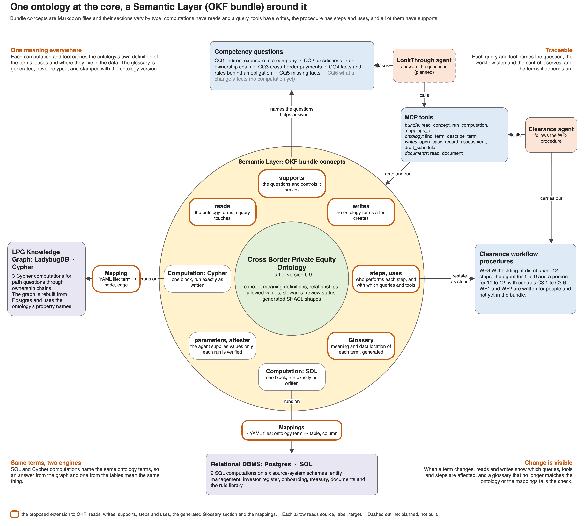

# OKF Ontology Grounding extension

A proposed extension to the [Open Knowledge Format v0.2](https://github.com/GoogleCloudPlatform/knowledge-catalog/blob/main/okf/SPEC.md). Status: draft, implemented in this repository for one workflow (WF3).

## Purpose

OKF describes a bundle of Markdown concepts that an agent can read and run. It does not say what the business terms in those concepts mean, or where the data behind a term lives. This extension ties every concept in a bundle to an ontology, so that a query, a tool and a procedure step all use a term in the same, governed sense.



## What it adds

| Element | Where | What it says |
|---|---|---|
| `reads` | Frontmatter of an Attested Computation | The ontology terms the query touches |
| `writes` | Frontmatter of a Tool | The ontology terms the tool creates |
| `supports` | Frontmatter of any concept | The competency questions, workflow steps and controls the concept serves |
| `steps` | Frontmatter of a Procedure | The steps in order. Each has `performed_by` (agent or human), `uses` (the computations and tools it relies on) and `supports` |
| `# Glossary` | Body section of a computation or tool | For each term in `reads` and `writes`: its kind, meaning, status and steward from the ontology, and where it lives in the data the concept works on, from the mappings. Headed by the ontology version |
| Mapping files | `references/mappings/` | Where the instances of each ontology term live: one file per source system, and one for the graph |
| `ontology` | Frontmatter of the bundle's `index.md` | The prefix used for terms, its namespace and the ontology file |

None of these is defined by OKF v0.2. The spec lets producers add keys and tells consumers not to reject them, so a bundle that uses the extension is still a valid OKF bundle. The mapping files are YAML, which the spec does not cover; they sit under `references/`, the spec's conventional place for supporting material.

## Rules

1. **Terms come from one ontology.** Every value in `reads` and `writes`, and every term in a mapping file, must be a term of the ontology.
2. **The glossary is generated.** It is written from the ontology and the mappings for exactly the terms in `reads` and `writes`, and is never edited by hand. Its first line gives the ontology version and links to the ontology and the mapping used.
3. **A stale glossary is an error.** When the ontology or a mapping changes, a glossary that no longer matches fails the bundle check until it is regenerated.
4. **A mapping says where to look. It is not a query.** For a table it gives the key and columns for a term, its links and validity period, and whether the source is the system of record. For the graph it gives the node or edge, its properties, and which end of an edge a relationship points to.
5. **Links resolve.** Every path in `uses` points to a concept in the bundle.

## Example

The snippets are abridged from the bundle. A computation names the terms it reads and what it serves:

```yaml
type: Attested Computation
title: Effective holding in a company
runtime: ladybug
reads: [xbpei:OwnershipInterest, xbpei:heldBy, xbpei:interestIn, xbpei:economicPercentage]
supports: [CQ1, WF3.6, C3.3]
```

Its glossary is generated from the ontology and the graph mapping:

```markdown
# Glossary

Meanings from ontology version 0.9, [xb-pei-model.ttl](../../../model/xb-pei-model.ttl). Locations from the graph mapping, [ladybug.yaml](../references/mappings/graph/ladybug.yaml). For the terms in `reads` and `writes`. Generated by `xbpei/bundle.py`; do not edit.

- **`xbpei:OwnershipInterest`** (class; reviewed; steward: Fund tax team)
  - Meaning: A holding by one party in one legal entity, with its own percentages, share class, validity period, governing agreement and evidence.
  - In the graph: a `HOLDS` edge from `Party` to `Party`.
- **`xbpei:heldBy`** (relationship; reviewed; steward: Fund administration)
  - Meaning: Of `xbpei:OwnershipInterest`. Value: `xbpei:Party`.
  - In the graph: the start of the `HOLDS` edge, a `Party` node.
```

A procedure step names who performs it and with what:

```yaml
steps:
  - id: 6
    title: Determine the rate for each recipient and component, and record the assessment behind it
    performed_by: agent
    uses: [/computations/tax-residence.md, /computations/effective-holding.md, /computations/declared-owners.md, /computations/ownership-cycles.md, /tools/record-assessment.md]
    supports: [C3.3]
```

A mapping says where a term lives, in a source system:

```yaml
- term: xbpei:OwnershipInterest
  table: shareholding
  key: holding_id
  properties:
    xbpei:economicPercentage: pct_econ
  links:
    xbpei:heldBy: {column: owner_entity_id, references: entity_mgmt.legal_entity.entity_id}
  interval: {property: xbpei:validDuring, start: eff_from, end: eff_to}
```

and in the graph:

```yaml
- term: xbpei:OwnershipInterest
  edge: HOLDS
  from: Party
  to: Party
  properties:
    xbpei:economicPercentage: economicPercentage
  links:
    xbpei:heldBy: from
    xbpei:interestIn: to
  interval: {property: xbpei:validDuring, start: validFrom, end: validTo}
```

## What it gives

- **One meaning everywhere.** A computation or tool carries the ontology's own definition of the terms it uses and where they live in the data, generated and stamped with the version.
- **Traceable.** Each query and tool names the question, the workflow step and the control it serves, and the terms it depends on.
- **Same terms, two engines.** SQL and Cypher computations name the same ontology terms.
- **Change is visible.** When a term changes, `reads` and `writes` show which queries, tools and steps are affected, and stale glossaries fail the check.

## Status in this repository

| Element | State |
|---|---|
| `reads` | On all 12 computations |
| `writes` | On 4 of the 5 tools; the fifth only reads a document |
| `supports` | On every computation, tool and procedure. CQ1 to CQ5 are covered; nothing supports CQ6 yet |
| `steps` | On the one procedure, WF3 |
| `# Glossary` | On all 16 concepts that read or write terms |
| Mapping files | Seven for the six source systems and Clearance, and one for the graph |
| `ontology` | Declared in `bundle/index.md` |

The checks are `python -m xbpei.bundle check` for rules 1, 3 and 5 and the `ontology` declaration, and `python -m xbpei.check_mappings` for the mapping files against the ontology, the database and the graph schema. `python -m xbpei.bundle glossary` writes or refreshes every glossary. `python -m xbpei.bundle affected <term>` lists what a term change touches.

## Open points

The generated glossaries show three things that are for the term stewards to settle:

- `computations/record-conflicts` reads `xbpei:evidencedBy`, which the graph does not hold. The query returns the source row of each edge, which is provenance and not a source document.
- `xbpei:BeneficialOwner` is held in no source system. Membership follows from the interests a party holds, and only the graph mapping says how.
- `xbpei:TaxResidence` has no definition in the ontology, and several relationships have a domain and range but no definition.
